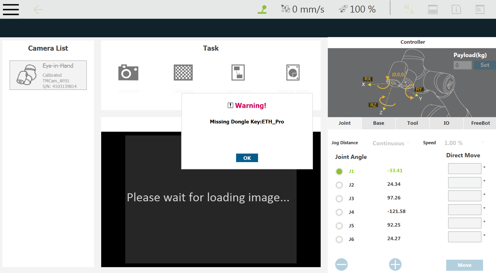
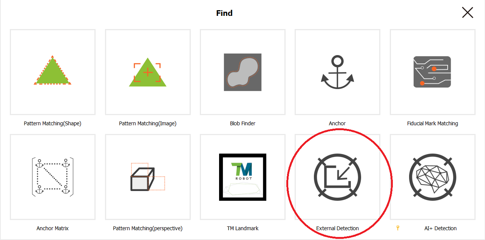
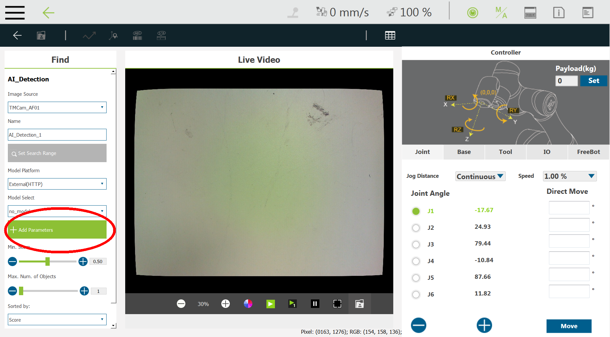

# __TM ROS Driver__

## __1. Overview__

The TM Robot is a state-of-the-art production tool that is highly compatible and flexible to collaboration between human and machine. The Robot Operating System (ROS) provides abundant libraries and tools which can be utilized to reduce the cost of trivial development software tool and build robot applications without struggling. Our TM ROS driver provides nodes for communication with Techman Robot controllers, data including robot states, images from the eye-in-hand camera and URDF models for various robot arms via _TMFlow_.

## __2. Feature__

This driver is for <u>**ROS2 Dashing**</u> version. <br/>
For using the driver, please make sure your ROS PC is installed correct.<br/>
If the user want to know how to use ROS1 driver, please go to [TM ROS1 driver](https://github.com/TechmanRobotInc/tmr_ros1).<br/>


More information: TM ROS driver list
|ROS Distribution|TM ROS 808080driver version|Remark: switch GitHub branches|
|:---|:---|:---:|
|[**<font color=#808080>ROS Noetic Ninjemys**](http://wiki.ros.org/noetic)|[<font color=#0000FF>**TM ROS1 Noetic driver**](https://github.com/TechmanRobotInc/tmr_ros1/tree/noetic)|noetic|
|[**<font color=#808080>ROS Melodic Morenia**](http://wiki.ros.org/melodic)|[<font color=#0000FF>**TM ROS1 Melodic driver**](https://github.com/TechmanRobotInc/tmr_ros1/)|master|
|[**<font color=#808080>ROS 2 Foxy Fitzroy**](https://index.ros.org/doc/ros2/Releases/Release-Foxy-Fitzroy/)|[**<font color=#800000>TM ROS2 Foxy driver**](https://github.com/TechmanRobotInc/tmr_ros2)|master|
|[**<font color=#808080>ROS 2 Dashing Diademata**](https://index.ros.org/doc/ros2/Releases/)|[<font color=#800000>**TM ROS2 Dashing driver**](https://github.com/TechmanRobotInc/tmr_ros2/tree/dashing-devel)|dashing-devel|
Note: The two current master branches are ROS1 Melodic and ROS2 Foxy.


### __ROS2 Driver__

The driver for ROS2 publishes identical topics and provides identical services as ROS1 version, but for now there is no interface integration with MoveIt.  
This driver uses _ROS2 composition_, there are two nodes in the identical process:
one node publishes topics while the other node sets up service servers.

> __ROS2 driver usage__

> If the user have set up the ROS2 environment and TM driver build based on a specific workspace, then type in your workspace`<workspace>` by starting a terminal, and remember to make the workspace visible to ROS.
>
> ```bash
> source /opt/ros/dashing-devel/setup.bash
> cd <workspace>
> source ./install/setup.bash
> ```


>Then, run the driver to connect to TM robot by type    
>
>```bash
>ros2 run tm_driver tm_driver <robot_ip>
>```
>
> __Techman robot vision__
>
> - type: sensor_msgs::msg::Image
> - message name: techman_image


## __3. Usage__

### __TMFlow setup__

> __Listen node__
>
> 1. Create a flow project; then choose the __listen__ node and the __Goto__ node
> 
>
> 2. Go to the __System/Network setting__ page  
Type network parameters of device for ROS
> 
>
> 3. Go to the __Setting/Connection__ page  
Enable the __Ethernet Slave__ item  
Click on the __Data Table Setting__ button and check the following boxes:
>
>       - [x] Robot_Error
>       - [x] Project_Run
>       - [x] Project_Pause
>       - [x] Safeguard_A
>       - [x] ESTOP
>       - [x] Camera_Light
>       - [x] Error_Code
>       - [x] Joint_Angle
>       - [x] Coord_Robot_Flange
>       - [x] Coord_Robot_Tool
>       - [x] TCP_Force
>       - [x] TCP_Force3D
>       - [x] TCP_Speed
>       - [x] TCP_Speed3D
>       - [x] Joint_Speed
>       - [x] Joint_Torque
>       - [x] Project_Speed
>       - [x] MA_Mode
>       - [x] Robot Light
>       - [x] Ctrl_DO0~DO7
>       - [x] Ctrl_DI0~DI7
>       - [x] Ctrl_AO0
>       - [x] Ctrl_AI0~AI1
>       - [x] END_DO0~DO3
>       - [x] END_DI0~DI2
>       - [x] END_AI0
>
>       
>
> __Vision__
>
> :warning: Before going through the following steps, please build the vision ROS node on other  (remote) computer and then connect this computer to the local techman robot computer.
>
> 1. Access the techman robot HMI and create a vision task.
> 2. Click the __AOI -only__ icon.
> 
>
>TMflow 1.76 second version only:<br/> 
>If no suitable dongle is detected, warning alerts will be displayed in the window.<br/>
> 
>TMflow 1.80 version: <br/>
>The user don't need dongle to activate this function.
>
> 3. Click the __Find__ icon.
> 
>
> 4. In TMflow 1.76 second version, click the __AI_Detection__ icon.<br/>
> 
> In TMflow 1.80 version, click the __External Detection__ icon.
> 
>
> 5. In TMflow 1.76 second version, click the __+ Add Parameters__ button.
> 
> In TMflow 1.80 version, click the __Setting__ button.
>

> 6. To check whether the connection succeeds or not, please enter ``ROS_COMPUTER_IP:6189/api`` in the __HTTP Parameters__ blank text and click the __Send__ button to get the information of the remote computer for ROS.
> 
>
>       If the connection fails, __TIMEOUT__ error will be displayed in the window
> 
>
>       If the IP address of the (remote) ROS computer doesn't exist, **ERROR_CODE_7** will be displayed in the window.
> 
> 7. Enter ``ROS_COMPUTER_IP:6189/api/DET`` in the URL blank text and type arbitrary letters in the __Value__ blank text; the __Key__ will be generated automatically.
> 
> 8. Finally, assign a name to the model in  the __Model name__ blank text and click the __Save__ button.
> 


## __4. Vision__

### __Get image data through Techman Robot ROS2 driver__

> :warning: This package can be built and run in ROS2 Dashing. Other versions might not work.
>
> __Dependencies__
>
> - ROS2 Dashing
> - Python packages:
>   1. flask
>   2. numpy
>   3. opencv-python==3.4.* (Minimum)
>   4. waitress
>   5. datetime
>
>

> __The Techman Robot ROS2 node which publishes image data__

> Under all environment settings have been finished with your workspace`<workspace>`, then type
>
> ```bash
> cd ~/workspace && source install/setup.bash
> ros2 run tm_get_status image_talker
> ```
>
> The terminal prints ``Serving on <your_ip_address>:6189`` if the initialization succeeds.
>
> ```bash
> ros2 run custom_package sub_img
> ```
>
> The viewer will display image data from _TMFlow_.


## __5. Code of Demo__
There are some demo codes showing  how to use this driver.

> 1. demo_send_script:<br/>
In this demo code, it shows how to send a listen node script to control the robot. <br/>
The user can use service named "send_script" to send script.<br/>
"id"->The transaction number expressed in any alphanumeric characters . (Reports the CPERR 04 error if a non-alphanumeric byte is encountered .  When used as a communication packet response , it is a transaction number and identifies which group of commands to respond.<br/>
"script"-> the script which the user want to send.<br/>
"ok" -> Correctness of the script.
> 2. demo_ask_item:<br/>
In this demo code, the user can use this service to send TMSCT cmd. More details please refer to the Expression Editor and Listen Node.pdf(Chapter7.4 TMSCT)<br/>
> 3. demo_ask_sta:<br/>
In this demo code, the user can use this service to send TMSTA cmd. More details please refer to the Expression Editor and Listen Node.pdf(Chapter7.5 TMSTA)<br/>
> 4. demo_connect_tm:<br/>
In this demo code, the user can set the connection type. <br/>
If the user set to reconnect as true, every time when driver disconnects from listen node, it will try to re-connect it.<br/>
There are two kind connection settings the user can select, one is "connect_tmsvr" for Ethernet server connection, and the other is "connect_tmsct" for setting TM-Flow connection.<br/>
> 5. demo_set_event:<br/>
In this demo code, six event types can be selected.<br/> 
func: TAG, WAIT_TAG, STOP, PAUSE, RESUME and EXIT<br/>
arg0: if func is TAG or WAIT_TAG, arg0 is timeout in ms<br/>
arg1: if func is TAG or WAIT_TAG, arg1 is id<br/>
> 6. demo_set_io:<br/>
In this demo code, the user should set module, type, pin and state. More details please refer to the Expression Editor and Listen Node.pdf(Chapter6.5 IO)<br/>
module : MODULE_CONTROLBOX or MODULE_ENDEFFECTOR<br/>
type: TYPE_DIGITAL_IN, TYPE_DIGITAL_OUT, TYPE_INSTANT_DO, TYPE_ANALOG_IN, TYPE_ANALOG_OUT, TYPE_INSTANT_AO<br/>
pin: pin number<br/>
state: STATE_OFF or STATE_ON or other value(if digitial IO)<br/>
> 7. demo_set_positions:<br/>
In this demo, the user should be careful with parameter units to operation.<br/>
motion_type : PTP_J , PTP_T , LINE_J , LINE_T , CIRC_J ,CIRC_T , PLINE_J ,PLINE_T.  More details please refer to the Expression Editor and Listen Node.pdf(Chapter8 PTP, Line, Circle, Pline, Move_PTP, Move_Line, Move_PLine) <br/>
positions : target position or target joint(rad)<br/>
velocity : joint velocity-> max value is Pi -> 3.14 rad/s , line velocity ->m/s <br/>
acc_time : to max speed time in millisecond<br/>
blend_percentage : 0 has no blending
fine_goal : In a real situation, the controller will check the erro of the final position and should wait a few milliseconds.<br/>
> 8. demo_write_item: <br/>
In this demo code, the user can use this service to send TMSVR cmd. More details please refer to the Expression Editor and Listen Node.pdf(Chapter9.3 svr_write())
> 9. demo_leave_listen_node:<br/>
In this demo code, the user can use send_script service sending a script to leave the listen node.


## Usage with demo code & driver
> Note: If the user have even successfully built a specific code(tmr_ros2), the user only need to change to the TM driver workspace path  ``cd ~/tmdriver_ws`` , and then directly refer to steps 5~6 below. <br/>
> 1. Type to create a root workspace directory by starting a terminal: For example,  ``tmdriver_ws`` or ``catkin_ws``, then type to change current directory into the workspace directory path.<br/>
``mkdir ~/tmdriver_ws``<br/>
``cd ~/tmdriver_ws``<br/>
> 2. Clone the the TM driver of git repository into the current directory by typing<br/>
``git clone https://github.com/TechmanRobotInc/tmr_ros2.git -b dashing-devel``<br/>
or<br/>
``git clone -b dashing-devel https://github.com/TechmanRobotInc/tmr_ros2.git``<br/>
> 3. After the download done, rename the download folder ``tmr_ros2``(or ``tmr_ros2-dashing-devel``) to ``src`` by typing<br/>
``mv tmr_ros2 src``<br/>  (or right-click on the download folder, select "Rename...")<br/>
> 4. At the workspace directory to build the download packages and source 'setup.bash' in this workspace to make the worksapce visible to ROS.<br/>
Note: Do you set ``source /opt/ros/dashing-devel/setup.bash`` ready? Make sure to obtain the correct setup file according to your workspace hierarchy, and then type the following below to compile.<br/>
``colcon build``<br/>
``source ./install/setup.bash``<br/>
> 5. In a new terminal: Source setup.bash in the workspace path and run the driver to connect to TM robot by typing<br/>
``source ./install/setup.bash``<br/>
``ros2 run tm_driver tm_driver <robot_ip>``<br/>
The <robot_ip> is the IP address of the TM robot, the user can get it through TM Flow, for example 192.168.10.2<br/>
> 6. In another new terminal: Source setup.bash in the workspace path and type specific demo node function which the user want to study for applications. For example: the user select to run demo_set_io, the user can type<br/>
``source ./install/setup.bash``<br/>
``ros2 run demo demo_set_io``<br/>
>[CAUTION]:warning: Some demos will let the robot move, please be careful.<br/>


## TM GUI debugging and demonstration
The GUI displays tm_driver connection status, sct, sta, svr messages and robot status. Easily judge the message between the driver and the robot through the GUI display. If the connection fails, the user can also try to send a reconnect command on this GUI for debugging.


### Usage with TM GUI debugging
> Note: If the user have even successfully built a specific code(tmr_ros2), the user only need to change to the TM driver workspace path  ``cd ~/tmdriver_ws`` , and then directly refer to steps 5~6 below. <br/>
> 1. Type to create a root workspace directory by starting a terminal: For example,  ``tmdriver_ws`` or ``catkin_ws``, then type to change current directory into the workspace directory path.<br/>
``mkdir ~/tmdriver_ws``<br/>
``cd ~/tmdriver_ws``
> 2. Clone the the TM driver of git repository into the current directory by typing<br/>
``git clone https://github.com/TechmanRobotInc/tmr_ros2.git -b dashing-devel``<br/>  
> 3. After the download done, rename the download folder ``tmr_ros2``(or ``tmr_ros2-dashing-devel``) to ``src`` by typing<br/>
``mv tmr_ros2 src``<br/>  (or right-click on the download folder, select "Rename...")<br/>
> 4. At the workspace directory to build the download packages and source 'setup.bash' in this workspace to make the worksapce visible to ROS.<br/>
Note: Do you set ``source /opt/ros/dashing-devel/setup.bash`` ready? Make sure to obtain the correct setup file according to your workspace hierarchy, and then type the following below to compile.<br/>
``colcon build``<br/>
``source ./install/setup.bash``<br/>
> 5. In a new terminal: Source setup.bash in the workspace path and run the driver to connect to TM robot by typing<br/>
``source ./install/setup.bash``<br/>
``ros2 run tm_driver tm_driver <robot_ip>``<br/>
The <robot_ip> is the IP address of the TM robot, the user can get it through TM Flow, for example 192.168.10.2
> 6. In another new terminal: Source setup.bash in the workspace path and start GUI debug by typing<br/>
``source ./install/setup.bash``<br/>
``ros2 run ui_for_debug_and_demo robot_ui``<br/>


### Debugging description
> * If ``is_srv_connect`` and ``is_sct_connect`` are true, it means that all connection is success.<br/>
> * If ``is_srv_connect`` is false, the user should check whether the data table is correct.<br/>
> * If ``is_sct_connect`` is false, the user should check whether the project is running.<br/>
> * If ``is_srv_connect`` and ``is_sct_connect`` are true, and the ``robot link`` is false, it means that the driver has connected to the TM project, but the TMFlow listen node is set to abnormal. Therefore, when the user send the move command, it does not work.<br/>
> * When the user send a command or click ``"change control box IO"``,  the user will see a response item embedded in the ``Robot Response``. For details of this item, please refer to ``SctResponse.msg``, ``StaResponse.msg`` and ``SvrResponse.msg``.<br/>
> * The user can click ``"clear"`` to clear the old response items.<br/>
> * If the user forget to run the ``tm_ros_driver``, the user will see all items displayed as ``"Not ini"``.<br/>